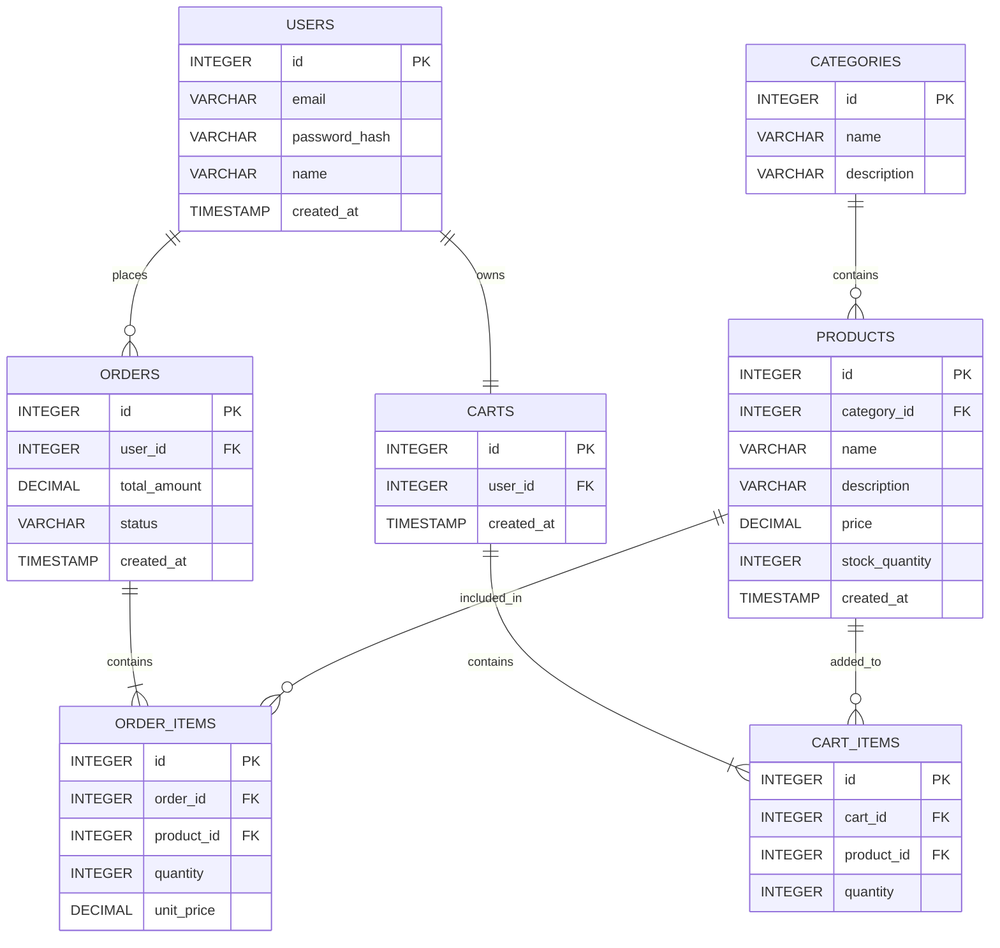

# E-Commerce SDLC Assignment

## Sprint 1: Architecture & Scope Definition

Course: E-Commerce SDLC
Project: ShelfLife
Sprint: 1 — Planning
Roll Number: 2k23/CSM/46

## 1. Target Audience & Market Focus

### Primary Persona

The main users of ShelfLife are people who like reading books and want to buy books online. The platform is mainly designed for students, university students, regular readers, and people who are looking for books for study or personal reading.

# Core Pain Point

Buying books can take time because customers may need to visit different shops to find the required book. It can also be difficult to check available books, prices, and stock before buying. ShelfLife provides an online platform where users can search for books, add them to a cart, and place orders from one website.

### Domain Scope

ShelfLife focuses on the online bookstore and e-commerce book market. The system will provide product browsing, book categories, cart management, and online order processing.

## 2. Minimum Viable Product (MVP) Feature Scope

The following features are planned for the first version of ShelfLife.

| Category       | Feature                   | Description                                                                         | Priority   |
| -------------- | ------------------------- | ----------------------------------------------------------------------------------- | ---------- |
| Authentication | User Registration & Login | Users can create an account and log in to the website.                              | High (MVP) |
| Catalog        | Book List & Search        | Users can browse books and search for a specific book.                              | High (MVP) |
| Categories     | Book Categories           | Books can be organized into categories such as Fiction, Education, and Programming. | High (MVP) |
| Cart           | Cart Management           | Users can add books to the cart, change quantity, and remove books.                 | High (MVP) |
| Checkout       | Order Processing          | Users can confirm their cart and create an order for the selected books.            | High (MVP) |
| Admin          | Inventory Control         | Admin can add, update, and remove books and manage available stock.                 | Medium     |

The MVP is limited to the main shopping workflows so that the core e-commerce system can be developed within the project timeline.

## 3. Tech Stack Selection & Justification

### Frontend Framework

Technology: React.js

Justification: React.js is suitable for creating a responsive and interactive e-commerce interface. It provides reusable components for pages such as the product list, product details, cart, and checkout. It is selected instead of using only basic HTML pages because it makes the interface easier to organize as the application grows.

### Backend Infrastructure

Technology: Node.js with Express.js

Justification: Node.js with Express.js provides a simple way to build REST APIs for the e-commerce system. It can handle requests related to users, products, carts, and orders and has a large ecosystem of packages.

### Database Management System

Technology: PostgreSQL

Justification: PostgreSQL is a relational database system and is suitable for ShelfLife because the application contains related entities such as users, products, categories, orders, and cart items. Foreign keys and relationships can help maintain data integrity.

### Caching & Asynchronous Processing

Technology: Redis — Optional

Justification: Redis can be used later for caching frequently accessed data or managing temporary session-related information. It is not required for the basic MVP and can be added when the application needs better performance.

## 4. Entity-Relationship Diagram (ERD)

The database design contains Users, Products, Categories, Orders, Order_Items, Carts, and Cart_Items.

### Relationships

Users can place many Orders.

Each User has one Cart.

One Category can contain many Products.

One Order can contain multiple Order_Items.

One Product can appear in many Order_Items.

One Cart can contain multiple Cart_Items.

One Product can appear in many Cart_Items.

### Mermaid ERD

### Cardinality Explanation

Users to Orders: 1:N
One user can place many orders.

Users to Carts: 1:1
Each user has one cart.

Categories to Products: 1:N
One category can contain many products.

Orders to Order_Items: 1:N
One order can contain multiple order items.

Products to Order_Items: 1:N
One product can appear in many order items.

Carts to Cart_Items: 1:N
One cart can contain multiple cart items.

Products to Cart_Items: 1:N
One product can appear in many cart items.
