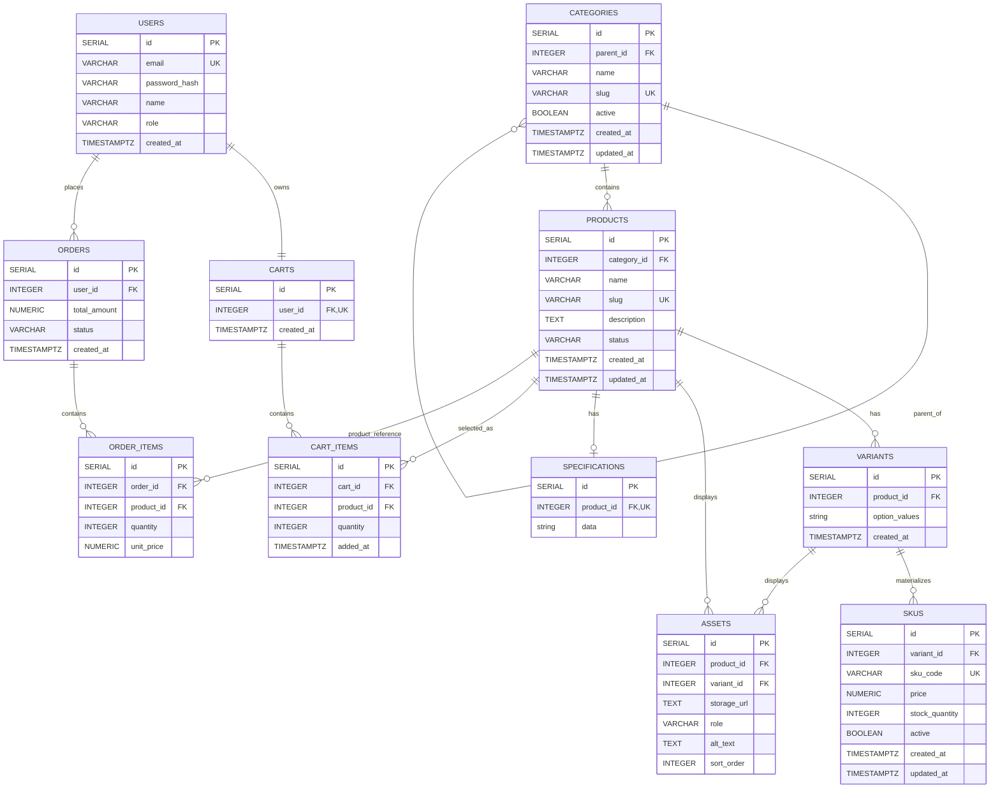

# Course: E-Commerce
# Project: ShelfLife
# Sprint 2: Catalog Data Foundation

## 1. Sprint Goal and Scope Boundary

Sprint 2 turns the Sprint 1 ShelfLife architecture into a reliable catalog database foundation. The implementation uses the Sprint 1 stack: Node.js with Express.js and PostgreSQL.

### In Scope

- Category tree with stable IDs, unique slugs, optional parent, create/update/deactivate/list operations.
- Product create/edit/list/archive with name, slug, description, status, and category assignment.
- Product variants with structured option values.
- SKU records with unique codes, decimal prices, non-negative stock, and active status.
- Authenticated administrator access for catalog write/read operations.
- PostgreSQL primary keys, foreign keys, unique constraints, and CHECK constraints.
- Migration SQL, reproducible seed data, automated tests, and local setup documentation.

### Out of Scope

Dynamic specifications editing, asset upload, public catalog search, publication workflows beyond the product status field, payment gateway, order placement, shipping integration, and complete shopper checkout remain Sprint 3 or later work.

## 2. Sprint 1 Decisions Reused or Changed

Sprint 1 selected:

- Frontend: React.js
- Backend: Node.js + Express.js
- Database: PostgreSQL
- Optional future caching: Redis

Sprint 2 keeps Node.js/Express.js/PostgreSQL and extends the Sprint 1 entities instead of replacing them. The original Users, Categories, Products, Orders, Order_Items, Carts, and Cart_Items relationships are retained and catalog entities are added for Variants, SKUs, Assets, and Specifications.

## 3. Updated ERD and Data Dictionary

### Mermaid ERD


### Data Dictionary

| Entity | Important fields | Integrity rule |
|---|---|---|
| Category | id, parent_id, name, slug, active, timestamps | slug UNIQUE; parent optional; cycle rejected by admin validation |
| Product | id, category_id, name, slug, description, status, timestamps | slug UNIQUE; category FK; status draft/published/archived |
| Variant | id, product_id, option_values | product FK; same product + same option values cannot repeat |
| SKU | id, variant_id, sku_code, price, stock_quantity, active | sku_code UNIQUE; price >= 0; stock >= 0 |
| Asset | id, product_id/variant_id, storage_url, role, alt_text, sort_order | at least one owner FK; upload is Sprint 3 |
| Specification | id, product_id, data | one specification record per product; JSONB reserved for Sprint 3 validation |
| Cart | id, user_id, created_at | one cart per user |
| Cart_Item | id, cart_id, product_id, quantity, added_at | quantity > 0 |
| Order | id, user_id, total_amount, status, created_at | amount >= 0; user FK protected |
| Order_Item | id, order_id, product_id, quantity, unit_price | quantity > 0; unit price >= 0 |

### Cardinality

- Category 0..1 parent -> many child categories.
- Category 1 -> many Products.
- Product 1 -> zero or many Variants.
- Variant 1 -> zero or many SKUs.
- Product 1 -> zero or many Assets.
- Product 1 -> zero or one Specification.
- User 1 -> one Cart.
- Cart 1 -> many Cart_Items.
- Order 1 -> many Order_Items.

### Foreign-key Policies

- Category.parent_id: `ON DELETE SET NULL`, `ON UPDATE CASCADE`.
- Product.category_id: `ON DELETE RESTRICT`, `ON UPDATE CASCADE`.
- Variant.product_id: `ON DELETE CASCADE`, `ON UPDATE CASCADE`.
- SKU.variant_id: `ON DELETE CASCADE`, `ON UPDATE CASCADE`.
- Asset product/variant references: `ON DELETE CASCADE`.
- Specification.product_id: `ON DELETE CASCADE`, `ON UPDATE CASCADE`.
- Cart/Order user references protect historical relationships using RESTRICT where appropriate.
- Cart items cascade with their cart; product references are RESTRICTed.
- Order items cascade with their order; product references are RESTRICTed.

### Money, Stock and Specification Rules

Prices use PostgreSQL `NUMERIC(12,2)`, not floating-point numbers. Stock uses `INTEGER CHECK (stock_quantity >= 0)`. Administrative API validation also rejects negative values.

If dynamic specifications are added in Sprint 3, the selected JSONB representation must validate that the top-level value is a JSON object, keys are known specification names, and values use the expected primitive/array type for each specification definition.

## 4. Administration Route Table and Examples

All `/api/v1/admin/*` routes require `Authorization: Bearer <JWT>` and an administrator role.

| Method | Route | Purpose | Success | Validation/auth failures |
|---|---|---|---|---|
| POST | `/api/v1/admin/categories` | Create category | 201 | 400/401/403 |
| GET | `/api/v1/admin/categories` | List category tree records | 200 | 401/403 |
| PATCH | `/api/v1/admin/categories/:id` | Update/deactivate category | 200 | 400/401/403/404 |
| DELETE | `/api/v1/admin/categories/:id` | Soft deactivate category | 200 | 401/403/404 |
| POST | `/api/v1/admin/products` | Create draft/product | 201 | 400/401/403 |
| GET | `/api/v1/admin/products` | List admin products | 200 | 401/403 |
| PATCH | `/api/v1/admin/products/:id` | Edit product/status | 200 | 400/401/403/404 |
| DELETE | `/api/v1/admin/products/:id` | Archive product | 200 | 401/403/404 |
| POST | `/api/v1/admin/products/:id/variants` | Add variant | 201 | 400/401/403/404 |
| POST | `/api/v1/admin/products/:id/skus` | Add SKU | 201 | 400/401/403 |
| PATCH | `/api/v1/admin/skus/:id` | Update price/stock/active | 200 | 400/401/403/404 |
| DELETE | `/api/v1/admin/skus/:id` | Deactivate SKU | 200 | 401/403/404 |

### Login

```http
POST /api/v1/auth/login
Content-Type: application/json

{"email":"admin@shelflife.local","password":"Admin@12345"}
```

Response shape:

```json
{"token":"<JWT>"}
```

The demo password is supplied through environment variables and must not be treated as a production secret.

### Create Category

```http
POST /api/v1/admin/categories
Authorization: Bearer <JWT>
Content-Type: application/json

{"name":"Programming","slug":"programming","parent_id":1}
```

Response shape:

```json
{"id":2,"parent_id":1,"name":"Programming","slug":"programming","active":true}
```

### Create Product

```http
POST /api/v1/admin/products
Authorization: Bearer <JWT>
Content-Type: application/json

{"name":"Python Programming Basics","slug":"python-programming-basics","description":"Beginner Python book","status":"draft","category_id":2}
```

Response shape contains `id`, `category_id`, `name`, `slug`, `description`, `status`, `created_at`, and `updated_at`.

### Create Variant and SKU

```http
POST /api/v1/admin/products/1/variants
Authorization: Bearer <JWT>
Content-Type: application/json

{"option_values":{"format":"paperback"}}
```

```http
POST /api/v1/admin/products/1/skus
Authorization: Bearer <JWT>
Content-Type: application/json

{"variant_id":1,"sku_code":"PY-BOOK-PB","price":1200,"stock_quantity":10,"active":true}
```

Duplicate slug/SKU returns a 400 client error with a clear `error` field. Negative stock or price is also rejected with 400.

### API Evidence Procedure

Run the login, category, product, variant and SKU requests above against the local application after `npm run migrate` and `npm run seed`. Save the resulting request/response output in this section before final submission. Tokens must be replaced with `<JWT>` and private URLs/secrets must be redacted.
### API Evidence (Captured Locally)

Environment: Local PostgreSQL, Node.js 18+, ShelfLife API on http://localhost:3000

#### 1. Login (POST /api/v1/auth/login)

Request Body:
{"email":"admin@shelflife.local","password":"Admin@12345"}

Response (200):
{"token":"<JWT>"}

#### 2. Get Categories (GET /api/v1/admin/categories)

Response (200):
[
  {"id":1,"parent_id":null,"name":"Computer Science","slug":"computer-science","active":true},
  {"id":2,"parent_id":1,"name":"Programming","slug":"programming","active":true},
  {"id":8,"parent_id":1,"name":"Web Development","slug":"web-development","active":true}
]

#### 3. Create Category (POST /api/v1/admin/categories)

Request Body:
{"name":"Fiction","slug":"fiction-2026"}

Response (201):
{"id":16,"parent_id":null,"name":"Fiction","slug":"fiction-2026","active":true,"created_at":"2026-10-01T16:59:57.435Z"}

#### 4. Create Product (POST /api/v1/admin/products)

Request Body:
{"name":"Sprint Demo Book","slug":"sprint-demo-book","description":"Demo for evidence","status":"draft","category_id":16}

Response (201):
{"id":22,"category_id":16,"name":"Sprint Demo Book","slug":"sprint-demo-book","status":"draft","created_at":"2026-10-01T17:02:13.381Z"}

#### 5. Create Variant (POST /api/v1/admin/products/22/variants)

Request Body:
{"option_values":{"format":"paperback"}}

Response (201):
{"id":29,"product_id":22,"option_values":{"format":"paperback"},"created_at":"2026-10-01T17:03:39.185Z"}

#### 6. Create SKU (POST /api/v1/admin/products/22/skus)

Request Body:
{"variant_id":29,"sku_code":"DEMO-SKU-001","price":999,"stock_quantity":10,"active":true}

Response (201):
{"id":28,"variant_id":29,"sku_code":"DEMO-SKU-001","price":"999.00","stock_quantity":10,"active":true,"created_at":"2026-10-01T17:05:05.624Z"}

#### 7. Get Products (GET /api/v1/admin/products) — Final Verify

Response (200):
[
  {"id":22,"name":"Sprint Demo Book","status":"draft","category_name":"Fiction"}
]


## 5. Data Integrity and Authorization Decisions

### Product/SKU Rules

- A draft product may exist without a SKU.
- A product intended to be published should have at least one active sellable SKU; the current API keeps the publication decision explicit through the product status field.
- Each product has one canonical category in Sprint 2 because Sprint 1 defined a simple category-to-product relationship. Multi-category tagging can be added later if required.
- A deactivated parent category remains in the database so existing product/category relationships are preserved. Its `active` flag becomes false.
- An out-of-stock SKU remains a real SKU with `stock_quantity = 0`, but it is not normally sellable while unavailable.
- Two SKUs may share the same price. Each SKU stores its own price, so a future price override does not require changing the product record.
- Negative stock is prevented by API validation and the PostgreSQL CHECK constraint.
- Duplicate SKU codes and slugs are prevented by database UNIQUE constraints and API error handling.
- Products referenced by future carts/orders are archived/deactivated instead of physically deleted so historical relationships remain safe.

### Variant Combination Rule

Only real combinations are stored as variants/SKUs. An unavailable combination is represented by its absence, not by creating a fake zero-stock record.

## 6. Seed Data and Demonstration Instructions

The reproducible seed creates:

- 2 category levels.
- 3 products.
- 1 product with multiple variants.
- 4 valid SKUs.
- 1 intentionally unavailable combination represented by no SKU row.

### Categories

| Name | Slug | Parent |
|---|---|---|
| Computer Science | `computer-science` | None |
| Programming | `programming` | Computer Science |

### Products

| Product | Slug | Category | Status |
|---|---|---|---|
| Python Programming Basics | `python-programming-basics` | Programming | published |
| Database Systems | `database-systems` | Computer Science | published |
| Web Development Guide | `web-development-guide` | Computer Science | draft |

### Valid Variants and SKUs

| Product | Variant | SKU Code | Price | Stock | Active |
|---|---|---|---:|---:|---|
| Python Programming Basics | Paperback | `PY-BOOK-PB` | 1200.00 | 10 | Yes |
| Python Programming Basics | Hardcover | `PY-BOOK-HC` | 1800.00 | 5 | Yes |
| Database Systems | Standard | `DB-STD-001` | 1500.00 | 8 | Yes |
| Web Development Guide | Paperback | `WEB-PB-001` | 1100.00 | 6 | Yes |

### Intentionally Unavailable Combination

`Python Programming Basics + eBook` is intentionally not created as a variant/SKU. This demonstrates CAT-04: a missing combination is not represented as a fake sellable SKU.

### Seed Command

```bash
npm run migrate
npm run seed
```

The seed is idempotent for the demonstration slugs/SKU codes and reads administrator credentials from environment variables.

### Demonstration Flow

1. Start PostgreSQL and create the `shelflife` database.
2. Copy `.env.example` to `.env` and set local values.
3. Run `npm install`, `npm run migrate`, and `npm run seed`.
4. Login as the seeded administrator.
5. Create/retrieve categories through the admin API.
6. Create/retrieve a product.
7. Create a variant and SKU.
8. Verify duplicate SKU/slug and negative-stock rejection.
9. Retrieve the final records with the admin GET endpoints.

## 7. Test Strategy, Command, and Result

Automated tests are included in `tests/sprint2.test.js` and cover:

- Required product creation fields.
- Required SKU fields.
- Duplicate product slug rejection.
- Duplicate SKU rejection.
- Negative stock rejection.
- Category hierarchy cycle prevention.
- Unauthenticated admin rejection (401).
- Authenticated non-admin rejection (403).

### Test Command

```bash
npm test
```

### Verification Status

The automated test suite was run successfully in the local repository after the required dependencies were installed. All five Sprint 2 tests passed.

```text
Test command:
npm.cmd test

Result:
PASS  tests/sprint2.test.js

Test Suites: 1 passed, 1 total
Tests:       5 passed, 5 total
Snapshots:   0 total
Time:        1.688 s
```

## 8. Known Limitations and Sprint 3 Backlog

### Known Limitations

- Dynamic specification management is not exposed through admin CRUD yet.
- Asset/image upload is not implemented.
- Public catalog search is not implemented.
- Complete publication workflow is not implemented.
- Payment gateway, shipping and complete shopper checkout are outside Sprint 2.
- API request/response evidence must be captured from the locally running application before final submission.

### Sprint 3 Backlog

- Dynamic product specifications and validation.
- Product/variant asset management.
- Public catalog reads and search.
- Publication workflow.
- Catalog-to-cart readiness.
- Shopper-facing catalog and later checkout integration.

### Sprint 3 Handoff

Sprint 3 should consume the catalog tables and SKU identities created here rather than duplicating product or pricing logic.

## Submission Checklist

- [x] `docs/SPRINT_1.md` retained in the same repository.
- [x] `docs/SPRINT_2.md` added beside Sprint 1.
- [x] PostgreSQL migration/schema included.
- [x] Authenticated admin CRUD/API implementation included.
- [x] Seed script included with 3 products, 2 category levels and 4 valid SKUs.
- [x] Automated test suite included.
- [x] README local setup and environment variables included.
- [ ] Run the local API and paste real request/response evidence.
- [x] Run `npm.cmd test` locally and record the real result: 5/5 tests passed.
- [ ] Commit and push the complete repository to the existing GitHub repo.
